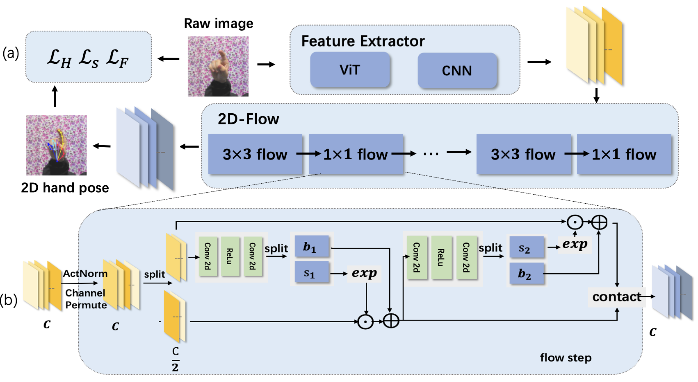
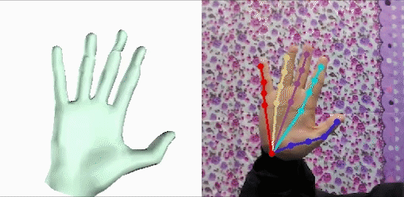

# 2DHandFlow - 2D Hand Estimation

This repo contains model, demo, training codes for our paper: "2D Hand Pose Estimation from A Single RGB Image through Flow Model"(ICARM2024)




## Install Requirements
Install the dependencies listed in `environment.yml` through conda:
- We recommend to firstly install Pytorch with cuda enabled.
- Create a new conda environment:
`conda env create -f environment.yml `
- Or in an existing conda environment:
`conda env update -f environment.yml`

The above operation works well if you are lucky.
However, we found that
installing opendr is tricky. We solved the errors by:
```
sudo apt-get install libglu1-mesa-dev freeglut3-dev mesa-common-dev
sudo apt-get install libosmesa6-dev
## then reinstall opendr again
pip install opendr
```

## Download and Prepare Datasets

- Create a data directory: `data`
- Download RHD dataset at the [dataset page](https://lmb.informatik.uni-freiburg.de/resources/datasets/RenderedHandposeDataset.en.html) and extract it in `data/RHD`.

- Download STB dataset at the [dataset page](https://sites.google.com/site/zhjw1988/) and extract it in `data/STB`
- Download `STB_supp` dataset at [Google Drive](https://drive.google.com/file/d/1uAP2-U_sQkl1Ez4JkaDl01DA-Qiq2PI-/view?usp=sharing) or [Baidu Pan](https://pan.baidu.com/s/1ja23wnTsPPsjLrkE6d8s-w)(`v858`) and merge it into `data/STB`.
 (In STB, We generated *aligned* and *segmented* hand depthmap from the original depth image)

Now your `data` folder structure should like this:
```
data/
    RHD/
        RHD_published_v2/
            evaluation/
            training/
            view_sample.py
            ...

    STB/
        images/
            B1Counting/
                SK_color_0.png
                SK_depth_0.png
                SK_depth_seg_0.png  <-- merged from STB_supp
                ...
            ...
        labels/
            B1Counting_BB.mat
            ...
```

## Download and Prepare model files

### MANO model
- Go to [MANO website](http://mano.is.tue.mpg.de/)
- Create an account by clicking *Sign Up* and provide your information
- Download Models and Code (the downloaded file should have the format `mano_v*_*.zip`). Note that all code and data from this download falls under the [MANO license](http://mano.is.tue.mpg.de/license).
- unzip and copy the `models` folder into the `manopth/mano` folder

Now Your `manopth` folder structure should look like this:
```
manopth/
  mano/
    models/
      MANO_LEFT.pkl
      MANO_RIGHT.pkl
      ...
  manopth/
    __init__.py
    ...
```

## Launch Demo & Eval

- First, add this into current bash or `~/.bashrc`:
```
export PYTHONPATH=/path/to/bihand:$PYTHONPATH
```

- to test on RHD dataset:
```
python run.py \
    --batch_size 8 --fine_tune rhd --checkpoint checkpoints --data_root data
```
- to test on STB dataset:
```
python run.py \
    --batch_size 8 --fine_tune stb --checkpoint checkpoints  --data_root data
```
- add `--vis` to visualize:




## Training
We can train model for 100 epochs:
```
python training/train_seednet_fastflow.py --net_modules seed --datasets stb rhd --ups_loss
```

